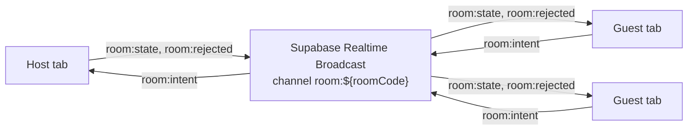
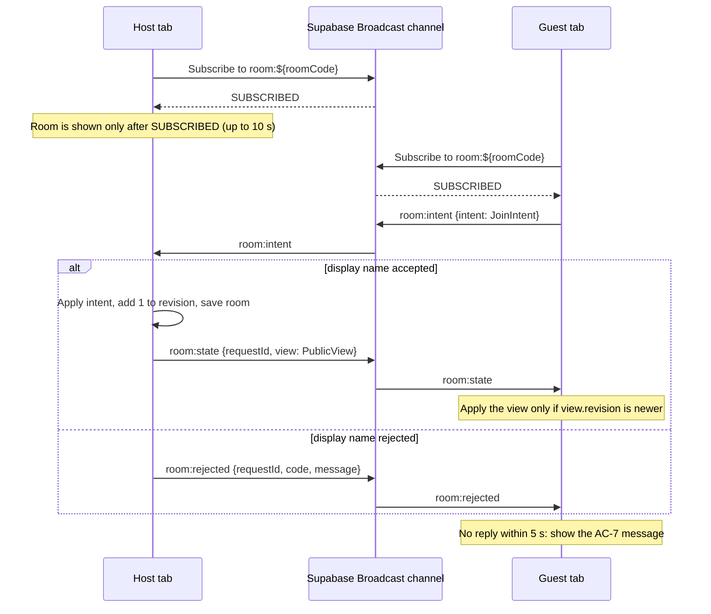

# Story Pointing App — Architecture

**Status:** Draft  
**Date:** 2026-10-07  
**Related:** [decisions](../knowledge/decisions.md) · [glossary](../knowledge/glossary.md) · [product brief](../product-brief.md) · [US-001 dev spec](../specs/US-001-dev-spec.md) · [Broadcast spike](../../spikes/broadcast-spike.mjs)

## 1. Context and goals

The app lets Scrum teams estimate stories together with planning poker.
The MVP supports creating and joining a room, voting privately on Fibonacci cards, and viewing results after reveal.
Participants use a share link and see live room updates across tabs, browsers, and devices.
Constraints: rooms are ephemeral; the app has no accounts, database, or custom backend; only free tiers are used; the whole product is built in one day.

## 2. Technology choices

Choices are recorded in [decisions](../knowledge/decisions.md); the reasons live there, not here.

| ID | Choice |
|---|---|
| D-001 | React 19, TypeScript, Vite |
| D-002 | Tailwind CSS v4 |
| D-003 | Supabase Realtime Broadcast, one channel per room, no database tables |
| D-004 | Host-authoritative state; guests send intents and the host broadcasts the public view |
| D-005 | Vote values remain on the host until reveal |
| D-006 | `sessionStorage` identity per tab |
| D-007 | Average excludes `?` votes |
| D-008 | Fixed Fibonacci scale: 0, 1, 2, 3, 5, 8, 13, 21, `?` |
| D-009 | Vitest for unit tests; Playwright for E2E |
| D-010 | Vercel hosting |
| D-011 | Every public view carries a `revision`; a guest applies a view only if it is newer (message order is not guaranteed) |
| D-012 | The host shows the room only after its channel is `SUBSCRIBED` and gives up after 10 seconds; a guest gives up after 5 seconds |
| D-013 | Channel `room:${roomCode}`; events `room:intent`, `room:state`, `room:rejected` |

## 3. System overview

**a. Broadcast flow**

**b. Guest joins**

## 4. Message contract

The event names and payload shapes follow the US-001 development spec.

| Event | Direction | Payload shape |
|---|---|---|
| `room:intent` | guest → host | `{ intent: JoinIntent }` |
| `room:state` | host → all | `{ requestId?: string; view: PublicView }` |
| `room:rejected` | host → guest | `{ requestId: string; code: RoomRejectionCode; message: string }` |

Types: `Participant { id: string; displayName: string; role: "host" | "guest" }`; `JoinIntent { type: "join"; requestId: string; participantId: string; displayName: string }`; `Room { code: string; hostParticipantId: string; participants: Participant[]; revision: number }`; `PublicView { roomCode: string; hostParticipantId: string; participants: Participant[]; revision: number }`.

**Ordering rule (D-011).** `revision` starts at 1 and goes up by 1 for every accepted change on the host. A rejected intent or an idempotent rejoin does not change it. A guest applies a view only if it holds none yet or the incoming `revision` is higher.

| sessionStorage key | Contents |
|---|---|
| `story-app:participant` | JSON `{ participantId, displayName, roomCode, role }` for the current tab's participant |
| `story-app:host-room` | JSON `Room` snapshot, written by the host only |

## 5. Source layout

| Folder/path | Purpose |
|---|---|
| `src/types/` | Shared TypeScript types for participant, room, public view, and messages. |
| `src/domain/` | Pure business rules and state transitions, including name and code validation and the reducer. |
| `src/storage/` | Per-tab identity and host room snapshot persistence. |
| `src/lib/` | Shared Supabase client configuration. |
| `src/realtime/` | Room Broadcast channel creation and message exchange. |
| `src/features/room/` | Room session coordination, create and join forms, participant-list view. |
| `src/App.tsx` | Composition of the home screen and room view. |

Validation and state transitions live in `src/domain` as plain functions; components and session code call them and hold no business rules. Unit tests sit next to the code as `src/**/*.test.ts`.

Repository layout outside `src/`:

| Folder | Purpose |
|---|---|
| `.github/` | Harness: Copilot instructions, custom agents (BA, Developer, Test), skills. |
| `docs/` | Artifacts: product brief, requirements, specs, test cases, design, knowledge base, token log. |
| `tests/` | Playwright E2E in `e2e/` and page objects in `page-objects/`. |
| `spikes/` | Throwaway proofs of platform assumptions; not part of the app build. |
| `scripts/` | Workshop helper scripts (token log, structure setup). |

## 6. Configuration and environments

- `VITE_SUPABASE_URL` — Supabase project URL used by the browser client.
- `VITE_SUPABASE_ANON_KEY` — public client key for Supabase Realtime.
- `.env.local` — local-only values; never committed (`.env.example` lists the names).
- Vercel project settings — planned; deployment is not done yet.

| Command | What it does |
|---|---|
| `npm run dev` | Vite dev server at `http://localhost:5173` |
| `npm run build` | Type-check and production build |
| `npm test` | Vitest unit tests (no network) |
| `npm run test:e2e` | Playwright E2E; starts the dev server; needs `.env.local` and network |
| `node --env-file=.env.local spikes/broadcast-spike.mjs` | Re-run the Broadcast spike |

E2E runs against the real Supabase project; there is no local Supabase.

## 7. Spike results

| Check | Result | Measured output |
|---|---|---|
| C1 — Host subscribes within 5000 ms | PASS | SUBSCRIBED in 2669 ms on room:SF5Y5D |
| C2 — Guest on unused code gets no reply within 5000 ms | PASS | SUBSCRIBED in 520 ms; received 0 broadcasts in 5000 ms |
| C3 — 10 guest-host round trips have max under 2000 ms | PASS | min 178 ms, median 191 ms, max 238 ms |
| C4 — Sender does not receive its own broadcast | PASS | guest received it; host did not after 1130 ms |
| C5 — 10 back-to-back intents arrive complete and in order | FAIL | received sequence 1,2,3,4,5,6,9,7,8,10 (140 ms) |
| C6 — Guest and guest2 intents both reach host | PASS | host received both in 115 ms |
| C7 — Handler keys and unchanged payload shape | PASS | handler keys: [type, event, payload]; sent payload unchanged under payload |
| C8 — Guest message does not call host handler after removeChannel | PASS | host handler not called during 2010 ms after removeChannel |

What the results changed:
- **C5 failed:** message order is not guaranteed, so guests apply views by `revision` (D-011). The script sent the 10 messages concurrently, so whether strictly sequential sends also arrive out of order was not measured; the design does not rely on order either way.
- **C1:** the host's first connection took 2669 ms (the two guests subscribed in 568 ms and 427 ms), so the host shows the room only after `SUBSCRIBED` and waits up to 10 seconds (D-012).
- **C2:** a guest can subscribe to a code with no host and simply gets no reply, so the 5-second timeout flow of AC-7 works as specified.
- **C3:** round trips of 178 to 238 ms leave a wide margin against the 2-second limit of AC-3.

Evidence: [broadcast-spike.mjs](../../spikes/broadcast-spike.mjs).

## 8. Risks and mitigations

| Risk | Mitigation |
|---|---|
| The host tab closes and the room ends | Accepted per D-004; a host refresh restores the room from `sessionStorage`; host migration is out of scope. |
| Messages arrive out of order | Guests apply a view only if its `revision` is newer (D-011). |
| Slow network: the guest's 5-second timeout includes subscribing | Accepted for the MVP; the guest sees the AC-7 message and can retry. |
| The realtime service is unreachable | The guest sees the AC-7 message; the host sees the AC-19 message and no room is created. |
| Anyone who knows a room code can join, send intents, or claim a participant id | Accepted for the MVP. The anon key is public by design and no service-role key is used in the browser. Vote values never leave the host before reveal (D-005). |
| Supabase free-tier limits (200 concurrent connections) | Unsubscribe when a channel owner unmounts; one channel per room. |

## 9. Testing approach

- **Unit (Vitest):** pure domain functions and reducer rules, colocated under `src/`, no network.
- **E2E (Playwright):** `tests/e2e` with page objects in `tests/page-objects`; separate browser contexts for host and guests; Chromium and Firefox; real Supabase.
- **Test cases:** `docs/test-cases/US-001-test-cases.md`; each acceptance criterion maps to test cases, and test names include `US-001` and the test case ID.
- **Traceability chain:** story acceptance criteria → dev spec → test cases → tests and code.

## 10. Open questions

None.
